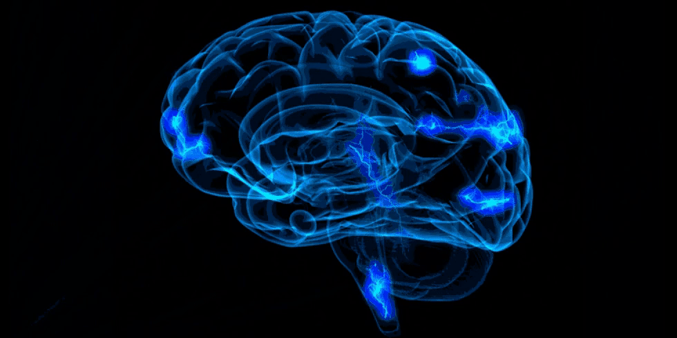

# Neurobiological Simulation 🧠 + ✨ + 🖥 = ⚡️🧠

A repository containing [assignments](https://github.com/celiasmith/syde556-f22/tree/master/assignments) for SYDE 556, Simulation Neurobiological Systems. Fall 2022

**[Github 🐙](https://github.com/SammyRobensParadise/neurobiological-simulation)**

**[Website 📊](https://sammyrobensparadise.github.io/neurobiological-simulation/)**

## Assignments

- [Assignment 1](./assignment-1/assignment-1.md)
- [Assignment 2](./assignment-2/assignment-2.md)
- [Assignment 3](./assignment-3/assignment-3.md)
- [Assignment 4](./assignment-4/assignment-4.md)
- [Assignment 5](./assignment-5/assignment-5.md)

## Contributors

- [Sammy Robens-Paradise](https://github.com/SammyRobensParadise)
