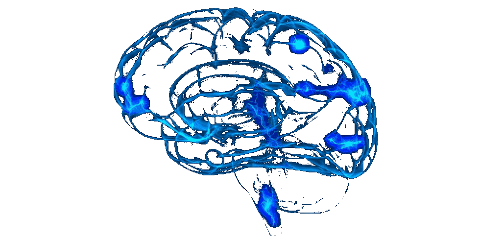

# Neurobiological Simulation 🧠 🖥 🧠

A repository containing [assignments](https://github.com/celiasmith/syde556-f22/tree/master/assignments) for SYDE 556, Simulation Neurobiological Systems. Fall 2022

## Contributors

- [Sammy Robens-Paradise](https://github.com/SammyRobensParadise)
