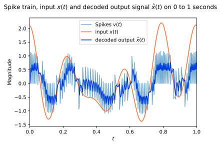

# SYDE 556/750 --- Assignment 3

**Student ID: 00000000**

_Note:_ Please include your numerical student ID only, do _not_ include your name.

_Note:_ Refer to the [PDF](https://github.com/celiasmith/syde556-f22/raw/master/assignments/assignment_03/syde556_assignment_03.pdf) for the full instructions (including some hints), this notebook contains abbreviated instructions only. Cells you need to fill out are marked with a "writing hand" symbol. Of course, you can add new cells in between the instructions, but please leave the instructions intact to facilitate marking.


```python
# Import numpy and matplotlib -- you shouldn't need any other libraries
import numpy as np
import matplotlib.pyplot as plt
from numpy import fft
from uuid import uuid4

# Fix the numpy random seed for reproducible results
s = 18945
np.random.seed(s)

# Some formating options
%config InlineBackend.figure_formats = ['svg']
```


```python
def rmse(x1, x2):
    return np.sqrt(np.mean(np.power(x1 - x2, 2)))


def rms(x):
    return np.sqrt(np.mean(np.power(x, 2)))
```

# 1. Decoding from a population

**a) Tuning curves.** Plot the tuning curves (firing rate of each neuron for different $x$ values between $-2$ and $2$).


```python
tau_ref = 2 / 1000
tau_rc = 20 / 1000


def maxJ(tau_ref=tau_ref, tau_rc=tau_rc, max_rate=200):
    return 1 / (1 - np.exp((tau_ref - 1 / max_rate) / tau_rc))


def gain(j_max=2, e=1, intercept=0):
    return (j_max - 1) / (2 - e * intercept)


def bias(alpha=1, e=1, intercept=0):
    return 1 - alpha * e * intercept


def lif_encode_2d(neuron, xy):
    J = neuron.a * np.vdot(xy, neuron.circ) + neuron.j_bias
    if J > 1:
        return 1 / (tau_ref - tau_rc * np.log(1 - 1 / J))
    return 0


def print_block(title, data):
    print(title + " ----------")
    print(data)
    print("-----------------")


class Population:
    def __init__(self, num_neurons=1, state=None, neuron_overrides=[]):
        self.num_neurons = num_neurons
        self.rates = []
        self.spikes = []
        if state == None:
            self.default_neuron_states = {
                "min_rate": 100,
                "max_rate": 200,
                "encoder": [-1, 1],
                "tau_ref": 2 / 1000,
                "tau_rc": 20 / 1000,
                "min_x_int": -2,
                "max_x_int": 2,
            }

        else:
            self.default_neuron_states = state
        self.neurons = []
        if len(neuron_overrides) == 0:
            for idx in range(self.num_neurons):
                neuron = Neuron(self.default_neuron_states)
                self.neurons.append(neuron)
        else:
            for neuron_override in neuron_overrides:
                print("Override Neuron " + str(neuron_override.get_id()))
                self.neurons.append(neuron_override)

    """ Cleans out a population """

    def nuke(self):
        self.neurons = []

    def clear_rates(self):
        self.rates = []

    def clear_spikes(self):
        self.spikes = []

    """ Applies a mutator to each neuron in the population """

    def mutate(self, mutator):
        if len(self.neurons) == 0:
            return
        else:
            for neuron in self.neurons:
                mutator(neuron)

    def spike(self, X, dT, cap=None):
        O = []
        for neuron in self.neurons:
            spikes = neuron.spikies(X, dT, cap)
            O.append(spikes)
        return O

    def get_curves(self, input):
        for neuron in self.neurons:
            self.rates.append(neuron.rates(input))
        return self.rates

    def get_neurons(self):
        return self.neurons

    def get_neuron_by_index(self, idx):
        return self.neurons[idx]

    def get_neuron_by_id(self, target_id):
        match = None
        for neuron in self.neurons:
            if target_id == neuron.get_id():
                match = neuron
        return match

    def get_spikes(self):
        spikes = []
        for neuron in self.neurons:
            spikes.append(neuron.get_spiketrend()[:, 1])
        self.spikes = spikes
        return spikes

    def get_voltages(self):
        voltages = []
        for neuron in self.neurons:
            voltages.append(neuron.get_spiketrend()[:, 0])
        self.voltages = voltages
        return voltages

    def get_ordered_encoders(self):
        encoders = []
        for neuron in self.neurons:
            encoders.append(neuron.get_encoder())
        return encoders

    def get_neuron_count(self):
        return len(self.neurons)

    def get_neurons_by_rate(self, rate_range=[20, 50], stim=0):
        target_neurons = []
        for neuron in self.neurons:
            rate = neuron.encode(stim)
            is_less_then_max = rate < rate_range[1]
            is_more_then_min = rate > rate_range[0]
            if is_less_then_max and is_more_then_min:
                target_neurons.append(neuron)
        return target_neurons


class Neuron(Population):
    def __init__(self, state=None, override=None):
        if override == None:
            self.x_int = np.random.uniform(state["min_x_int"], state["max_x_int"])
            self.max_rate = np.random.uniform(state["min_rate"], state["max_rate"])
            self.e = np.random.choice(state["encoder"])
            self.tau_ref = state["tau_ref"]
            self.tau_rc = state["tau_rc"]
            J_max = maxJ(
                tau_ref=self.tau_ref, tau_rc=self.tau_rc, max_rate=self.max_rate
            )
            self.alpha = gain(J_max, self.e, self.x_int)
            self.j_bias = bias(alpha=self.alpha, e=self.e, intercept=self.x_int)
            self.id = uuid4()
            self.spiketrend = []
            self.firing_rates = []
        else:
            self.x_int = override["x_int"]
            self.max_rate = override["max_rate"]
            self.e = override["encoder"]
            self.tau_ref = override["tau_ref"]
            self.tau_rc = override["tau_rc"]
            self.alpha = override["alpha"]
            self.j_bias = override["j_bias"]
            self.id = uuid4()
            self.spiketrend = override["spiketrend"]
            self.firing_rates = override["firing_rates"]

    def whoisthis(self):
        print(self.__dict__)

    def encode(self, x):
        J = self.alpha * x * self.e + self.j_bias
        if J > 1:
            return 1 / (self.tau_ref - self.tau_rc * np.log(1 - 1 / J))
        return 0

    def encodeJ(self, x):
        return self.alpha * (x) * self.e + self.j_bias

    def voltage(self, J, V, dT):
        return V + (dT * (1 / self.tau_rc) * (J - V))

    def howmanyspikes(self):
        spike_points = self.spiketrend[:, 1]
        num_spikes = int(spike_points.tolist().count(1))
        return num_spikes

    def get_intercept(self):
        return self.x_int

    def get_gain(self):
        return self.alpha

    def get_bias(self):
        return self.j_bias

    def get_max_rate(self):
        return self.max_rate

    def get_tau_rc(self):
        return self.tau_rc

    def get_tau_ref(self):
        return self.tau_ref

    def get_id(self):
        return self.id

    def set_encoder(self, encoder):
        self.e = encoder

    def get_encoder(self):
        return self.e

    def me(self):
        return self

    def dangerously_set_id(self, ied):
        self.id = ied

    def set_rate(self, rate):
        self.max_rate = rate

    def set_bias(self, bias):
        self.j_bias = bias

    def set_gain(self, gain):
        self.alpha = gain

    def get_spiketrend(self):
        return self.spiketrend

    def get_rates(self):
        return self.firing_rates

    def rates(self, x):
        self.firing_rates = []
        for point in x:
            self.firing_rates.append(self.encode(point))
        return self.firing_rates

    def clear_rates(self):
        self.firing_rates = []

    def spikies(self, X, dT, cap=None):
        N = np.floor(self.tau_ref / dT)
        V_th = 1
        V_rest = 0
        spikes = np.array([np.zeros(len(X)), np.zeros(len(X))]).T
        V = V_rest
        V_prev = V_rest
        ref_period = False
        for idx, x in enumerate(X):
            if ref_period == True:
                V = V_rest
                V_prev = V_rest
                # voltage is 0
                spikes[idx][0] = 0
                # no spike so set it to 0
                spikes[idx][1] = 0
                # we have completed one ref cycle
                ref_period = False
            else:
                J = self.encodeJ(x)
                V = self.voltage(J, V_prev, dT)
                if V >= V_th:
                    # we have a spike so assign second column to 1 to indicate a spike
                    spikes[idx][1] = int(1)
                    # start the ref period
                    ref_period = True
                    # assign the first collumn to the current voltage
                    # assign a constant spiking voltage to make identification easier
                    if cap != None:
                        spikes[idx][0] = cap
                    else:
                        spikes[idx][0] = V
                    # reset the voltage to 0
                    V = V_rest
                    V_prev = V_rest
                else:
                    if V < V_rest:
                        V = V_rest
                    # no spikes to assign second column to 0
                    spikes[idx][1] = int(0)
                    # still capture the voltage
                    spikes[idx][0] = V
                    # assign the previous voltage to the current voltage for next iteration
                    V_prev = V
        self.spiketrend = spikes
        return spikes
```


```python
# we want 20 neurons
num_neurons = 20
# with this default state
state = {
    "min_rate": 100,
    "max_rate": 200,
    "encoder": [-1, 1],
    "tau_ref": 2 / 1000,
    "tau_rc": 20 / 1000,
    "min_x_int": -2,
    "max_x_int": 2,
}

# create a population of 20 neurons with the default states
ensemble1 = Population(
    num_neurons,
    state=state,
)
S = 81  # samples
X = np.linspace(-2, 2, S)
curves = np.array(ensemble1.get_curves(X))

plt.figure()
plt.suptitle(
    "LIF Neuron Turning curves from population of 20 randomly generated neurons"
)
for curve in curves:
    plt.plot(X, curve)
plt.xlabel("$x$ stimuli")
plt.ylabel("$\\alpha$ Hz")
plt.xlim([-2, 2])
plt.ylim([0, 200])
plt.show()
```


    

    


**b) Decoder and error computation.** Compute the decoders and plot $(x-\hat{x})$. When computing decoders, take into account noise ($\sigma=0.1 \cdot 200\,\mathrm{Hz}$). When computing $\hat{x}$, add random Gaussian noise with $\sigma=0.1 \cdot 200\,\mathrm{Hz}$ to the activity. Report the Root Mean-Squared Error (RMSE).


```python
A = curves
X = X
noise_stdev = 0.1 * 200
w_noise = np.random.normal(scale=noise_stdev, size=np.shape(A))
A_NOISE = A + w_noise
N = len(X)
n = num_neurons
# find decoders via least squares solution
D = np.linalg.lstsq(
    A @ A.T + 0.5 * N * np.square(noise_stdev) * np.eye(n), A @ X.T, rcond=None
)[0]

print_block("Decoders with noise", D)

X_hat = np.dot(D, A_NOISE)
X = np.array(X)
E = X - X_hat

plt.figure()
plt.suptitle("$x-\hat{x}$ with Noisey Decoders and Noise in the activities matrix $A$")
plt.plot(X, E)
plt.xlabel("stimuli $x$")
plt.ylabel("$x-\hat{x}$")
plt.xlim([-2, 2])
plt.show()

plt.figure()
plt.suptitle("$x$ and $\hat{x}$ relative to the stimuli $x$")
x1 = plt.plot(X, X_hat, label="$x$")
x2 = plt.plot(X, X, label="$\hat{x}$")
plt.xlim([-2, 2])
plt.legend(handles=[x1, x2], labels=[])
plt.xlabel("stimuli $x$")
plt.show()


print_block("RMSE", rmse(X, X_hat))
```

    Decoders with noise ----------
    [-0.00068122 -0.00101302 -0.00127595  0.0001646  -0.00072472 -0.00063046
      0.0018315   0.0016065  -0.00056462  0.00216541  0.00076354 -0.00112071
      0.00170102  0.00196816 -0.00276315 -0.00117113  0.00196086 -0.00127341
     -0.00057206  0.00146749]
    -----------------


    

    


    

    


    RMSE ----------
    0.12919565696552784
    -----------------


# 2. Decoding from two spiking neurons

**a) Synaptic filter.** Plot the post-synaptic current
$$
			h(t)= \begin{cases}
				0 & \text{if } t < 0 \,, \\
				\frac{e^{-t/\tau}}{\int_0^\infty e^{-t'/\tau} \mathrm{d}t'} & \text{otherwise} \,.
			\end{cases}
		$$


```python
def signal_rms(signal):
    return np.sqrt(np.mean(np.power(signal, 2)))


def im_normal_rand():
    return np.random.normal() + np.random.normal() * 1j


def symmetry_exists(f, F):
    neg = -f
    return neg in F and f != 0, np.where(F == neg)


def locations(index):
    return int(index[0])


def rescale(signal, ideal_rms):
    cur_rms = signal_rms(signal)
    rescaled_signal = [p * ideal_rms / cur_rms for p in signal]
    return rescaled_signal


def zippify(F, Z):
    return (list(tt) for tt in zip(*sorted(zip(F, Z))))


def generate_signal(T, dt, rms, limit, seed):
    if seed != 0:
        np.random.seed(int(seed))
    timescale = np.arange(0, T, dt)
    # get the number of points so that we can create a signal in the frequency domain
    num_pts = len(timescale)
    # convert to frequency domain
    F = fft.fftfreq(num_pts, dt)
    # create a frequenct signal of zeros
    length_F = len(F)
    # create zeros for the frequency domain
    zeros = np.zeros(length_F)
    Z = zeros.tolist()

    for idx, f in enumerate(F):
        if Z[idx] == 0:
            magnitude_f = abs(f)
            if magnitude_f <= limit:
                im = im_normal_rand()
                Z[idx] = im
                # ensure that we account for the negative symmetric value
                exists, index = symmetry_exists(f, F)
                if exists:
                    location = locations(index)
                    # assig it to the complex conjugate
                    Z[location] = np.conj(im)
        else:
            continue
    # perform inverse fft
    z = fft.ifft(Z)
    # select the real components
    z = z.real
    # rescale based on the current and ideal rmse
    z = rescale(z, rms)

    # convert back to frequency domain
    Z = fft.fft(z)
    # touple Z so that it aligns with our intial number of samples
    F, Z = zippify(F, Z)
    return z, Z


def plot_signal(
    signal, domain="time", T=1, dt=1 / 1000, show_rmse=True, bandwidth=False
):
    t = np.arange(0, T, dt)
    if domain == "time":
        plt.figure()
        plt.plot(t, signal["x"])
        if bandwidth:
            plt.suptitle(
                "$x(t)$ signal with " + str(signal["freq"]) + " Hz bandwidth",
            )
        else:
            plt.suptitle(
                "$x(t)$ signal with " + str(signal["freq"]) + " Hz limit",
            )
        plt.xlabel("$t$ sec.")
        plt.ylabel("$x(t)$")
        plt.xlim([0, T])
        plt.show()
        if show_rmse:
            print("time-domain RMSE " + str(np.round(signal_rms(signal["x"]), 3)))
    if domain == "frequency":
        plt.figure()
        plt.plot(t, signal["X"])
        if bandwidth:
            plt.suptitle(
                "$x(\omega)$ signal with " + str(signal["freq"]) + " Hz bandwidth",
            )
        else:
            plt.suptitle(
                "$x(\omega)$ signal with " + str(signal["freq"]) + " Hz limit",
            )
        plt.xlabel("$w$ Hz.")
        plt.ylabel("$x(\omega)$")
        plt.show()
        if show_rmse:
            print("frequency-domain RMSE " + str(np.round(signal_rms(signal["X"]), 3)))


def synaptic_filter(tau=5 / 1000, dt=1 / 1000, ms=1000):
    t_h = np.arange(ms) * dt - 0.5
    h = (1 / tau) * np.exp(-t_h / tau)
    h[np.where(t_h < 0)] = 0
    h = h / np.linalg.norm(h, 1)
    return h, t_h


def filter(x, h, t):
    return np.convolve(x, h, mode="same")[: len(t)]
```


```python
import copy

neuron_candidates = ensemble1.get_neurons_by_rate(rate_range=[20, 50], stim=0)
candidate = np.random.choice(neuron_candidates)


override = {
    "x_int": candidate.get_intercept(),
    "max_rate": candidate.get_max_rate(),
    "encoder": candidate.get_encoder(),
    "tau_ref": candidate.get_tau_ref(),
    "tau_rc": candidate.get_tau_rc(),
    "alpha": candidate.get_gain(),
    "j_bias": candidate.get_bias(),
    "spiketrend": candidate.get_spiketrend(),
    "firing_rates": candidate.get_rates(),
}


neuron_1 = Neuron(state=None, override=override)
neuron_2 = Neuron(state=None, override=override)


neuron_1.set_encoder(1)
neuron_1.dangerously_set_id(uuid4())
neuron_2.set_encoder(-1)
neuron_1.set_encoder(1)

# create an ensemble wiht our neuron
ensemble2 = Population(state=None, neuron_overrides=[neuron_1, neuron_2])


# generate input signal
T = 1
dt = 1 / 1000
rms = 1
limit = 5
t = np.arange(0, T, dt)
x, X = generate_signal(T, dt, rms, limit, s)

# spike the neurons by giving them an input signal
ensemble2.spike(x, dt)

# generate synapic filter
h, t_h = synaptic_filter(tau=5 / 1000, dt=dt, ms=T * 1000)


plt.figure()
plt.suptitle("Post-Synaptic Current Filter $h(t)$ with $\\tau=0.005$")
plt.xlabel("$t$ (seconds)")
plt.ylabel("$h(t)$")
x1 = plt.plot(t_h, h, label="$h(t)$")
plt.legend(handles=[x1], labels=[])
plt.xlim([-0.4, 0.4])
plt.show()
```

    Override Neuron dd43720e-778f-494a-bfea-e2e8c5645195
    Override Neuron 97fe8877-4d60-414d-ab51-ddbc27887695


    

    


**b) Decoding using a synaptic filter.** Plot the original signal $x(t)$, the spikes, and the decoded $\hat{x}(t)$ all on the same graph.


```python
# from part a)
neuron_pos_encoder = ensemble2.get_neuron_by_index(0)
neuron_neg_encoder = ensemble2.get_neuron_by_index(1)

# make sure we have the correct signed encoder
assert neuron_pos_encoder.get_encoder() == 1
assert neuron_neg_encoder.get_encoder() == -1


# get the first colum of the outputs which is the voltages
v_out_pos = neuron_pos_encoder.get_spiketrend()#[:, 0]
v_out_neg = neuron_neg_encoder.get_spiketrend()#[:, 0]

# checking that they are reflections of themselves
assert np.array(v_out_neg).all() == -1 * np.array(v_out_pos).all()

# align spikes
spikes = np.array([v_out_pos, v_out_neg])
r = spikes[0] - spikes[1]


x_hat = filter(x, h, t)

plt.figure()
plt.suptitle(
    "Spike train, input $x(t)$ and decoded output signal $\hat{x}(t)$ on 0 to 1 seconds"
)
a = plt.plot(t, r, label="Spikes $v(t)$", alpha=0.6)
b = plt.plot(t, x, label="input $x(t)$", alpha=0.8, color="#FF4D00")
c = plt.plot(t, x_hat, label="decoded output $\hat{x}(t)$", color="#003DDE")
plt.xlim([0, 1])
plt.legend(handles=[a, b, c], labels=[])
plt.xlabel("$t$")
plt.ylabel("Magnitude")
plt.show()
```


    

    


**c) Error analysis.** Compute the RMSE of the decoding.


```python
print_block("RMSE",rmse(x,x_hat))
```

    RMSE ----------
    0.1737740187209444
    -----------------


# 3. Decoding from many neurons

**a) Exploring the error for an increasing neuron count.** Plot the Root Mean-Squared Error as the number of neurons increases, on a log-log plot. Try $8$ neurons, $16$ neurons, $32$, $64$, $128$, up to $256$. For the RMSE for a particular number of neurons, average over at least $5$ randomly generated groups of neurons. For each group of neurons, randomly generate the signal $x(t)$. Use the same parameters as in question 2.


```python
# create sets of neurons
neuron_sets = [8, 16, 32, 64, 128, 256]
num_sets = 5
# with this default state
state = {
    "min_rate": 100,
    "max_rate": 200,
    "encoder": [-1, 1],
    "tau_ref": 2 / 1000,
    "tau_rc": 20 / 1000,
    "min_x_int": -2,
    "max_x_int": 2,
}

populations = []
# create populations
for amount in neuron_sets:
    set = []
    for count in range(num_sets):
        ensemble = Population(num_neurons=amount, state=state)
        set.append(ensemble)
    populations.append(set)

T = 1
dt = 1 / 1000
rms = 1
limit = 5
t = np.arange(0, T, dt)


# generate synapic filter
h, t_h = synaptic_filter(tau=5 / 1000, dt=dt, ms=T * 1000)

# spike the neurons
population_errors_spike = []
population_errors_activities = []
for population_set in populations:
    set_errors_spike = []
    set_errors_activites = []
    for idx, population in enumerate(population_set):
        x, X = generate_signal(T, dt, rms, limit, s)
        population.spike(x, dt)
        curves = np.array(population.get_curves(x))
        population_spikes = np.array(population.get_spikes())
        ordered_encoders = np.array(population.get_ordered_encoders())
        r = np.zeros(len(t))
        for idx, population_spike in enumerate(population_spikes):
            if ordered_encoders[idx] == 1:
                r = r + population_spike
            if ordered_encoders[idx] == -1:
                r = r - population_spike
            else:
                r = r
        x_hat = filter(r, h, t)
        error_denom_spike = rmse(x, x_hat)
        set_errors_spike.append(1 / error_denom_spike)

        A = curves
        noise_stdev = 0.1 * 200
        w_noise = np.random.normal(scale=noise_stdev, size=np.shape(A))
        A_NOISE = A + w_noise
        N = len(x)
        n = population.get_neuron_count()
        x = np.array(x)
        # find decoders via least squares solution
        D = np.linalg.lstsq(
            A @ A.T + 0.5 * N * np.square(noise_stdev) * np.eye(n), A @ x.T, rcond=None
        )[0]
        x_hat_activities = np.dot(D, A_NOISE)
        x = np.array(x)
        error_activities = rmse(x, x_hat_activities)
        set_errors_activites.append(error_activities)

    mean_error_spikes = np.mean(np.array(set_errors_spike))
    mean_error_activites = np.mean(np.array(set_errors_activites))
    population_errors_spike.append(mean_error_spikes)
    population_errors_activities.append(mean_error_activites)


for idx, errors in enumerate(population_errors_spike):
    print_block("RMSE for " + str(neuron_sets[idx]) + " neurons from spikes", errors)
    print_block(
        "RMSE for " + str(neuron_sets[idx]) + " neurons from activities",
        population_errors_activities[idx],
    )


n = [1 / N for N in neuron_sets]

fig = plt.figure()
ax = fig.add_subplot(1, 1, 1)
plt.title("Log Log trend of RMSE errors with respect to number of neurons")
x1 = ax.plot(neuron_sets, population_errors_spike, label="Spiking Errors")
x2 = ax.plot(neuron_sets, n, "--", label="$1/n$")
x3 = ax.plot(neuron_sets, population_errors_activities, "--", label="Activities Error")
ax.set_xscale("log")
ax.set_yscale("log")
ax.legend(handles=[x1, x2, x3], labels=[])
plt.xlabel("Neurons")
plt.ylabel("Squared Error")
plt.show()

fig = plt.figure()
ax = fig.add_subplot(1, 1, 1)
plt.title("No log trend of RMSE errors with respect to number of neurons")
x1 = ax.plot(neuron_sets, population_errors_spike, label="Spiking Errors")
x2 = ax.plot(neuron_sets, n, "--", label="$1/n$")
x3 = ax.plot(neuron_sets, population_errors_activities, "--", label="Activities Error")
ax.legend(handles=[x1, x2, x3], labels=[])
plt.xlabel("Neurons")
plt.ylabel("Squared Error")
plt.show()
```

    RMSE for 8 neurons from spikes ----------
    1.375865756122073
    -----------------
    RMSE for 8 neurons from activities ----------
    0.2556622504392272
    -----------------
    RMSE for 16 neurons from spikes ----------
    1.8411883465592354
    -----------------
    RMSE for 16 neurons from activities ----------
    0.16655459817920598
    -----------------
    RMSE for 32 neurons from spikes ----------
    1.8713342921109977
    -----------------
    RMSE for 32 neurons from activities ----------
    0.10514449469879364
    -----------------
    RMSE for 64 neurons from spikes ----------
    0.6888350588291419
    -----------------
    RMSE for 64 neurons from activities ----------
    0.07087349168376288
    -----------------
    RMSE for 128 neurons from spikes ----------
    0.24927442973092223
    -----------------
    RMSE for 128 neurons from activities ----------
    0.04914791260802407
    -----------------
    RMSE for 256 neurons from spikes ----------
    0.11778318037163224
    -----------------
    RMSE for 256 neurons from activities ----------
    0.03514458778002315
    -----------------


    

    


    

    


**b) Discussion.** Discuss your results. What is the systematic relationship between the neuron count and the error?


As we can see from the above graphs, there is a negative exponentialy decaying relationship beween the number of neurons and the error. As we increase the number of neurions we see a rapid decrease in the error until we reach about 200 neurons in the population at which point we begin to see a decay in the decrease in the error, relative to the increase in the number of neurons. What can be  said is that generally speaking
$$
\begin{equation}
Error \propto \frac{1}{N}, \Rightarrow \text{ as } N \to \infty, Error \to 0
\end{equation}
$$
where $N$ is the integer number of neurons encoding and decoding an input in a population

# 4. Connecting two groups of neurons

**a) Computing a function.** Show the behaviour of the system with an input of $x(t)=t-1$ for $1\,\mathrm{s}$ (a linear ramp from $-1$ to $0$). Plot the ideal $x(t)$ and $y(t)$ values, along with $\hat{y}(t)$.


```python
def decoder(signal=[], A=[], num_neurons=200):
    X = signal
    noise_stdev = 0.1 * 200
    w_noise = np.random.normal(scale=noise_stdev, size=np.shape(A))
    A_NOISE = A + w_noise
    N = len(X)
    n = num_neurons
    # find decoders via least squares solution
    D = np.linalg.lstsq(
        A @ A.T + N * np.square(noise_stdev) * np.eye(n),
        A @ X.T,
        rcond=None,
    )[0].T
    return D, A_NOISE


# we want 200 neurons
num_neurons = 200
# with this default state
state = {
    "min_rate": 100,
    "max_rate": 200,
    "encoder": [-1, 1],
    "tau_ref": 2 / 1000,
    "tau_rc": 20 / 1000,
    "min_x_int": -1,
    "max_x_int": 1,
}

# create a population of 200 neurons with the default states
ensemble_x = Population(num_neurons=200, state=state)
ensemble_y = Population(num_neurons=200, state=state)


T = 1
dt = 1 / 1000
rms = 1
limit = 5
t = np.arange(-1, 1, dt)

h, t_h = synaptic_filter(tau=5 / 1000, dt=dt, ms=T * 1000)


# y(x) = x
x1 = np.linspace(-1, 0, len(t))
# y(x) = 2x+1
x2 = [2 * t + 1 for t in x1]


curves_x = np.array(ensemble_x.get_curves(x2))
curves_y = np.array(ensemble_y.get_curves(x1))

# create matrix of activities
A_X = curves_x
A_Y = curves_y

# generate decoders
D_X, A_X_NOISE = decoder(signal=np.array(x2), A=A_X, num_neurons=num_neurons)
D_Y, A_Y_NOISE = decoder(signal=np.array(x1), A=A_Y, num_neurons=num_neurons)

# make sure we have all our decoders
assert len(D_X) == num_neurons
assert len(D_Y) == num_neurons


# make test input
ls = np.linspace(-1, 0, len(t))
x = [t - 1 for t in ls]

ensemble_x.spike(x, dt)
spike_x = np.array(ensemble_x.get_spikes())

fspikes = []
for spike in spike_x:
    fspike = np.convolve(spike, h, mode="same")
    fspikes.append(fspike)

A = np.array(fspikes)

x_hat = np.dot(D_X, A / dt)

ensemble_y.spike(x_hat, dt)
spike_y = np.array(ensemble_y.get_spikes())

fspikes = []
for spike in spike_y:
    fspike = np.convolve(spike, h, mode="same")
    fspikes.append(fspike)

A = np.array(fspikes)

y_hat = np.dot(D_Y, A / dt)

plt.figure()
plt.suptitle("Decoded $\hat{y}$ and inputs")
a = plt.plot(ls, y_hat, label="$\hat{y}$")
plt.xlim([-1, 0])
b = plt.plot(ls, x, label="$x(t)=x-1$")
c = plt.plot(ls, x1, label="$f(y)=y$")
d = plt.plot(ls, x2, label="$y=2x+1$")
plt.legend(handles=[a, b, c], labels=[])
plt.show()
```


    

    


**b) Step input.** Repeat part (a) with an input that is ten randomly chosen values between -1 and 0, each one held for 0.1 seconds (a randomly varying step input)


```python
values = []
num_values = 10
dt = 1 / 1000

for idx in range(num_values):
    value = np.random.uniform(-1, 0)
    values.append(value)

t = np.arange(-1, 0, dt)

x = []
for value in values:
    x_n = np.ones(int(len(t) / len(values))) * value
    x = x + x_n.tolist()

ensemble_x.spike(x, dt)
spike_x = np.array(ensemble_x.get_spikes())

fspikes = []
for spike in spike_x:
    fspike = np.convolve(spike, h, mode="same")
    fspikes.append(fspike)

A = np.array(fspikes)

x_hat = np.dot(D_X, A / dt)

ensemble_y.spike(x_hat, dt)
spike_y = np.array(ensemble_y.get_spikes())

fspikes = []
for spike in spike_y:
    fspike = np.convolve(spike, h, mode="same")
    fspikes.append(fspike)

A = np.array(fspikes)

y_hat = np.dot(D_Y, A / dt)

y = [2 * k + 1 for k in x]

plt.figure()
plt.suptitle("Decoded $\hat{y}$ and inputs")
a = plt.plot(t, y_hat, label="$\hat{y}$")
plt.xlim([-1, 0])
b = plt.plot(t, x, label="$x(t)=STEP$")
c = plt.plot(t, y, label="$y$")
plt.legend(
    handles=[a, b, c],
    labels=[],
)
plt.xlabel("$t$")
plt.show()
```


    

    


**c) Sinusoidal input.** Repeat part (a) with an input that is $x(t)=0.2\sin(6\pi t)$.


```python
dt = 1 / 1000

t = np.arange(-1, 0, dt)

x = [0.2 * np.sin(6 * np.pi * pt) for pt in t]

ensemble_x.spike(x, dt)
spike_x = np.array(ensemble_x.get_spikes())

fspikes = []
for spike in spike_x:
    fspike = np.convolve(spike, h, mode="same")
    fspikes.append(fspike)

A = np.array(fspikes)

x_hat = np.dot(D_X, A / dt)

ensemble_y.spike(x_hat, dt)
spike_y = np.array(ensemble_y.get_spikes())

fspikes = []
for spike in spike_y:
    fspike = np.convolve(spike, h, mode="same")
    fspikes.append(fspike)

A = np.array(fspikes)

y_hat = np.dot(D_Y, A / dt)

y = [2 * k + 1 for k in x]

plt.figure()
plt.suptitle("Decoded $\hat{y}$ and inputs")
a = plt.plot(t, y_hat, label="$\hat{y}$")
plt.xlim([-1, 0])
plt.xlabel("$t$")
b = plt.plot(t, x, label="$x(t)=0.2\sin(6\pi t)$")
c = plt.plot(t, y, label="$y$")
plt.legend(
    handles=[a, b, c],
    labels=[],
)
plt.show()
```


    

    


**d) Discussion.** Briefly discuss the results for this question. Does the output match the ideal output? What kind of deviations do you see and why do those exist?


The output does not match the ideal input. while it seems to match the general "shape" of the ideal output, it is generally translated or scaled incorrectly, It does however, generally match the input $x(t)$ quite well. We was also observed is that feeding $\hat{x}$ into the second neuron population seemed to address some of the large amounts of noise in the signal, This makes sense because the signal would be undergoing a second filter with $h(t)$. Generally speaking, the neurons performed better than expected given that they were tuned on a completely different function than the one that was fed into the network.

# 5. Connecting three groups of neurons

**a) Sinusoidal input.** Plot $x(t)$, $y(t)$, the ideal $z(t)$, and the decoded $\hat{z}(t)$ for an input of $x(t)=\cos(3\pi t)$ and $y(t)=0.5 \sin (2 \pi t)$ (over $1\,\mathrm{s}$).


```python
# we want 200 neurons
num_neurons = 200
# with this default state
state = {
    "min_rate": 100,
    "max_rate": 200,
    "encoder": [-1, 1],
    "tau_ref": 2 / 1000,
    "tau_rc": 20 / 1000,
    "min_x_int": -1,
    "max_x_int": 1,
}

# create a population of 200 neurons with the default states
ensemble_x = Population(num_neurons=200, state=state)
ensemble_y = Population(num_neurons=200, state=state)
ensemble_z = Population(num_neurons=200, state=state)


T = 1
dt = 1 / 1000
rms = 1
limit = 5
t = np.arange(0, 1, dt)

h, t_h = synaptic_filter(tau=5 / 1000, dt=dt, ms=T * 1000)


# f(x)=0.5x
x = [0.5 * pt for pt in t]

# f(y)=2y
y = [2 * pt for pt in t]

# z(x,y) = 2y + 0.5x
tune_z = [pt[0] + pt[1] for pt in zip(x, y)]

curves_x = np.array(ensemble_x.get_curves(x))
curves_y = np.array(ensemble_y.get_curves(y))
curves_z = np.array(ensemble_z.get_curves(tune_z))

# create matrix of activities
A_X = curves_x
A_Y = curves_y
A_Z = curves_z

# generate decoders
D_X, A_X_NOISE = decoder(signal=np.array(x), A=A_X, num_neurons=num_neurons)
D_Y, A_Y_NOISE = decoder(signal=np.array(y), A=A_Y, num_neurons=num_neurons)
D_Z, A_Z_NOISE = decoder(signal=np.array(tune_z), A=A_Z, num_neurons=num_neurons)


# make sure we have all our decoders
assert len(D_X) == num_neurons
assert len(D_Y) == num_neurons
assert len(D_Z) == num_neurons


x_input = [np.cos(3 * np.pi * pt) for pt in t]
y_input = [0.5 * np.sin(2 * np.pi * pt) for pt in t]
z_ideal= [pt[0] + pt[1] for pt in zip(x_input, y_input)]

ensemble_x.spike(x_input, dt)
spike_x = np.array(ensemble_x.get_spikes())

fspikes = []
for spike in spike_x:
    fspike = np.convolve(spike, h, mode="same")
    fspikes.append(fspike)

Ax = np.array(fspikes)

x_hat = np.dot(D_X, Ax / dt)

ensemble_y.spike(y_input, dt)
spike_y = np.array(ensemble_y.get_spikes())

fspikes = []
for spike in spike_y:
    fspike = np.convolve(spike, h, mode="same")
    fspikes.append(fspike)
Ay = np.array(fspikes)
y_hat = np.dot(D_Y, Ay / dt)


z_input = [pt[0] + pt[1] for pt in zip(x_hat, y_hat)]
ensemble_z.spike(z_input, dt)
spike_z = np.array(ensemble_z.get_spikes())

fspikes = []
for spike in spike_z:
    fspike = np.convolve(spike, h, mode="same")
    fspikes.append(fspike)
Az = np.array(fspikes)
z_hat = np.dot(D_Z, Az / dt)

plt.figure()
plt.suptitle("Decoded $\hat{z}$ and inputs $x,y$ with ideal output $z$")
a = plt.plot(t, z_hat, label="$\hat{z}$")
plt.xlim([0, 1])
b = plt.plot(t, x_input, label="$x_{ideal}$")
c = plt.plot(t, y_input, label="$y_{ideal}$")
d = plt.plot(t, z_ideal, label="$z_{ideal}$")
plt.legend(handles=[a, b, c], labels=[])
plt.show()
```


    

    


**b) Random input.** Plot $x(t)$, $y(t)$, the ideal $z(t)$, and the decoded $\hat{z}(t)$ for a random input over $1\,\mathrm{s}$. For $x(t)$ use a random signal with a limit of $8\,\mathrm{Hz}$ and $\mathtt{rms}=1$. For $y(t)$ use a random signal with a limit of $5\,\mathrm{Hz}$ and $\mathtt{rms}=0.5$.


```python
x_input, X_input = generate_signal(T=1, dt=1 / 1000, rms=1, limit=8, seed=S)

y_input, Y_input = generate_signal(T=1, dt=1 / 1000, rms=0.5, limit=5, seed=S)

z_ideal = [pt[0] + pt[1] for pt in zip(x_input, y_input)]

ensemble_x.spike(x_input, dt)
spike_x = np.array(ensemble_x.get_spikes())

fspikes = []
for spike in spike_x:
    fspike = np.convolve(spike, h, mode="same")
    fspikes.append(fspike)

Ax = np.array(fspikes)

x_hat = np.dot(D_X, Ax / dt)

ensemble_y.spike(y_input, dt)
spike_y = np.array(ensemble_y.get_spikes())

fspikes = []
for spike in spike_y:
    fspike = np.convolve(spike, h, mode="same")
    fspikes.append(fspike)
Ay = np.array(fspikes)
y_hat = np.dot(D_Y, Ay / dt)


z_input = [pt[0] + pt[1] for pt in zip(x_hat, y_hat)]
ensemble_z.spike(z_input, dt)
spike_z = np.array(ensemble_z.get_spikes())

fspikes = []
for spike in spike_z:
    fspike = np.convolve(spike, h, mode="same")
    fspikes.append(fspike)
Az = np.array(fspikes)
z_hat = np.dot(D_Z, Az / dt)

plt.figure()
plt.suptitle("Decoded $\hat{z}$ and inputs $x,y$ with ideal output $z$")
a = plt.plot(t, z_hat, label="$\hat{z}$")
plt.xlim([0, 1])
b = plt.plot(t, x_input, label="$x_{ideal}$")
c = plt.plot(t, y_input, label="$y_{ideal}$")
d = plt.plot(t, z_ideal, label="$z_{ideal}$")
plt.legend(handles=[a, b, c], labels=[])
plt.show()
```


    

    


# 6. Computing with vectors

**a) Constant inputs.** Plot the decoded output $\hat{w}(t)$ and the ideal $w$ for
$$x =(0.5,1), \quad y = (0.1,0.3), \quad z =(0.2,0.1), \quad q = (0.4,-0.2) \,.$$


```python
# Create our 2D LIF Neurons and 2D LIF Neuron Populations

tau_ref = 2 / 1000
tau_rc = 20 / 1000


def maxJ2D(tau_ref=tau_ref, tau_rc=tau_rc, max_rate=200):
    return 1 / (1 - np.exp((tau_ref - 1 / max_rate) / tau_rc))


def gain2D(j_max=2, e=1, intercept=0):
    return (j_max - 1) / (2 - np.vdot(e, intercept))


def bias2D(alpha=1, e=1, intercept=0):
    return 1 - alpha * np.vdot(e, intercept)


class Population2D:
    def __init__(self, num_neurons=1, state=None, neuron_overrides=[]):
        self.num_neurons = num_neurons
        self.rates = []
        self.spikes = []
        if state == None:
            self.default_neuron_states = {
                "min_rate": 100,
                "max_rate": 200,
                "encoder": [0, 2 * np.pi],
                "tau_ref": 2 / 1000,
                "tau_rc": 20 / 1000,
                "min_angle": 0,
                "max_angle": 2 * np.pi,
                "max_radius": 2,
            }

        else:
            self.default_neuron_states = state
        self.neurons = []
        if len(neuron_overrides) == 0:
            for idx in range(self.num_neurons):
                neuron = Neuron2D(self.default_neuron_states)
                self.neurons.append(neuron)
        else:
            for neuron_override in neuron_overrides:
                print("Override Neuron " + str(neuron_override.get_id()))
                self.neurons.append(neuron_override)

    """ Cleans out a population """

    def nuke(self):
        self.neurons = []

    def clear_rates(self):
        self.rates = []

    def clear_spikes(self):
        self.spikes = []

    """ Applies a mutator to each neuron in the population """

    def mutate(self, mutator):
        if len(self.neurons) == 0:
            return
        else:
            for neuron in self.neurons:
                mutator(neuron)

    def spike(self, X, dT, cap=None):
        O = []
        for neuron in self.neurons:
            spikes = neuron.spikies(X, dT, cap)
            O.append(spikes)
        return O

    def get_curves(self, input):
        for neuron in self.neurons:
            self.rates.append(neuron.rates(input))
        return self.rates

    def get_neurons(self):
        return self.neurons

    def get_neuron_by_index(self, idx):
        return self.neurons[idx]

    def get_neuron_by_id(self, target_id):
        match = None
        for neuron in self.neurons:
            if target_id == neuron.get_id():
                match = neuron
        return match

    def get_spikes(self):
        spikes = []
        for neuron in self.neurons:
            spikes.append(neuron.get_spiketrend()[:, 1])
        self.spikes = spikes
        return spikes

    def get_voltages(self):
        voltages = []
        for neuron in self.neurons:
            voltages.append(neuron.get_spiketrend()[:, 0])
        self.voltages = voltages
        return voltages

    def get_ordered_encoders(self):
        encoders = []
        for neuron in self.neurons:
            encoders.append(neuron.get_encoder())
        return encoders

    def get_neuron_count(self):
        return len(self.neurons)

    def get_neurons_by_rate(self, rate_range=[20, 50], stim=0):
        target_neurons = []
        for neuron in self.neurons:
            rate = neuron.encode(stim)
            is_less_then_max = rate < rate_range[1]
            is_more_then_min = rate > rate_range[0]
            if is_less_then_max and is_more_then_min:
                target_neurons.append(neuron)
        return target_neurons


class Neuron2D(Population2D):
    def __init__(self, state=None, override=None):
        if override == None:
            self.angle = np.random.uniform(state["min_angle"], state["max_angle"])
            self.r = np.random.uniform(0, state["max_radius"])
            self.x_int = [self.r * np.cos(self.angle), self.r * np.sin(self.angle)]
            self.max_rate = np.random.uniform(state["min_rate"], state["max_rate"])
            self.encoder_angle = np.random.uniform(
                state["min_angle"], state["max_angle"]
            )
            self.e = [np.cos(self.encoder_angle), np.sin(self.encoder_angle)]
            self.tau_ref = state["tau_ref"]
            self.tau_rc = state["tau_rc"]
            J_max = maxJ2D(
                tau_ref=self.tau_ref, tau_rc=self.tau_rc, max_rate=self.max_rate
            )
            self.alpha = gain2D(J_max, self.e, self.x_int)
            self.j_bias = bias2D(alpha=self.alpha, e=self.e, intercept=self.x_int)
            self.id = uuid4()
            self.spiketrend = []
            self.firing_rates = []
        else:
            self.x_int = override["x_int"]
            self.max_rate = override["max_rate"]
            self.e = override["encoder"]
            self.tau_ref = override["tau_ref"]
            self.tau_rc = override["tau_rc"]
            self.alpha = override["alpha"]
            self.j_bias = override["j_bias"]
            self.id = uuid4()
            self.spiketrend = override["spiketrend"]
            self.firing_rates = override["firing_rates"]

    def whoisthis(self):
        print(self.__dict__)

    def encode(self, x):
        J = self.alpha * np.vdot(x, self.e) + self.j_bias
        if J > 1:
            return 1 / (self.tau_ref - self.tau_rc * np.log(1 - 1 / J))
        return 0

    def encodeJ(self, x):
        return self.alpha * np.vdot(x, self.e) + self.j_bias

    def voltage(self, J, V, dT):
        return V + (dT * (1 / self.tau_rc) * (J - V))

    def howmanyspikes(self):
        spike_points = self.spiketrend[:, 1]
        num_spikes = int(spike_points.tolist().count(1))
        return num_spikes

    def get_intercept(self):
        return self.x_int

    def get_gain(self):
        return self.alpha

    def get_bias(self):
        return self.j_bias

    def get_max_rate(self):
        return self.max_rate

    def get_tau_rc(self):
        return self.tau_rc

    def get_tau_ref(self):
        return self.tau_ref

    def get_id(self):
        return self.id

    def set_encoder(self, encoder):
        self.e = encoder

    def get_encoder(self):
        return self.e

    def me(self):
        return self

    def dangerously_set_id(self, ied):
        self.id = ied

    def set_rate(self, rate):
        self.max_rate = rate

    def set_bias(self, bias):
        self.j_bias = bias

    def set_gain(self, gain):
        self.alpha = gain

    def get_spiketrend(self):
        return self.spiketrend

    def get_rates(self):
        return self.firing_rates

    def rates(self, x):
        self.firing_rates = []
        for point in x:
            self.firing_rates.append(self.encode(point))
        return self.firing_rates

    def clear_rates(self):
        self.firing_rates = []

    def spikies(self, X, dT, cap=None):
        N = np.floor(self.tau_ref / dT)
        V_th = 1
        V_rest = 0
        spikes = np.array([np.zeros(len(X)), np.zeros(len(X))]).T
        V = V_rest
        V_prev = V_rest
        ref_period = False
        for idx, x in enumerate(X):
            if ref_period == True:
                V = V_rest
                V_prev = V_rest
                # voltage is 0
                spikes[idx][0] = 0
                # no spike so set it to 0
                spikes[idx][1] = 0
                # we have completed one ref cycle
                ref_period = False
            else:
                J = self.encodeJ(x)
                V = self.voltage(J, V_prev, dT)
                if V >= V_th:
                    # we have a spike so assign second column to 1 to indicate a spike
                    spikes[idx][1] = int(1)
                    # start the ref period
                    ref_period = True
                    # assign the first collumn to the current voltage
                    # assign a constant spiking voltage to make identification easier
                    if cap != None:
                        spikes[idx][0] = cap
                    else:
                        spikes[idx][0] = V
                    # reset the voltage to 0
                    V = V_rest
                    V_prev = V_rest
                else:
                    if V < V_rest:
                        V = V_rest
                    # no spikes to assign second column to 0
                    spikes[idx][1] = int(0)
                    # still capture the voltage
                    spikes[idx][0] = V
                    # assign the previous voltage to the current voltage for next iteration
                    V_prev = V
        self.spiketrend = spikes
        return spikes
```


```python
# we want 200 neurons
num_neurons = 200
# with this default state
state = {
    "min_rate": 100,
    "max_rate": 200,
    "encoder": [0, 2 * np.pi],
    "tau_ref": 2 / 1000,
    "tau_rc": 20 / 1000,
    "min_angle": 0,
    "max_angle": 2 * np.pi,
    "max_radius": 2,
}

# create 5 populations of 200 neurons with the default states
ensemble_x = Population2D(num_neurons=200, state=state)
ensemble_y = Population2D(num_neurons=200, state=state)
ensemble_z = Population2D(num_neurons=200, state=state)
ensemble_q = Population2D(num_neurons=200, state=state)
ensemble_w = Population2D(num_neurons=200, state=state)


```

**b) Sinusoidal input.** Produce the same plot for
$$x =(0.5,1), \quad y = (\sin(4\pi t),0.3), \quad z =(0.2,0.1), \quad q = (\sin(4\pi t),-0.2) \,.$$


```python
# ✍ <YOUR SOLUTION HERE>
```

**c) Discussion.** Describe your results and discuss why and how they stray from the expected answer.


✍ \<YOUR SOLUTION HERE\>

